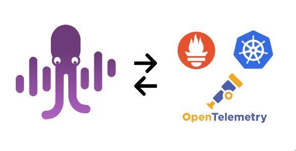

+++
title = 'About MyDecisive'
weight = 5
+++

## Company Overview

### Our Vision

At MyDecisive, we address a critical challenge in managing vast amounts of telemetry data: the struggle for control over the data pipeline. Many organizations have relied on observability platforms for managing telemetry data, but they often get caught up in the proprietary methods for collecting, storing, and displaying metrics, events, logs, and traces creating silos that make it tough for teams to get a complete picture of their applications and systems.

At MyDecisive, we offer an open-source platform powered by OpenTelemetry and enhanced by technologies like Kubernetes (K8s) and Prometheus.

Our platform equips DevOps teams with robust capabilities, enabling them to take control of their entire telemetry pipeline. With MyDecisive’s dynamic configurations and automated workflows, you can define how data is collected, presented, and utilized before it leaves your cloud. This flexibility allows you to build observability pipelines that can be automatically updated and re-deployed as data streams evolve. By leveraging MyDecisive, enterprises gain full control over their telemetry data, empowering them to derive meaningful insights from their applications and infrastructure.

### History and Thought Leadership

Founded in 2023, MyDecisive was created to tackle the challenges associated with managing telemetry data, particularly the issues of inflexibility and lack of control in data pipelines. Our commitment to open-source software shines through in our leadership team's active collaboration with several notable open-source projects, including EHCache, Kafka, JBoss, Tomcat, Druid, Hadoop, and Postgres. This collaboration demonstrates our passion and dedication to community-driven development and innovation.

At MyDecisive, we don't just understand observability; we have lived it. Our leadership team boasts over 30 years of combined expertise in the observability space, having navigated the most complex challenges in enterprise data monitoring and analysis. Our leadership team includes CEO Ari Zilka, VP of Engineering Jill Magsaysay, Head of Design Alan Florsheim, and Chief of Staff Fiona O’Shea, all committed to advancing the field and delivering exceptional solutions.

Learn more about the [MDAI platform](platform.html).
