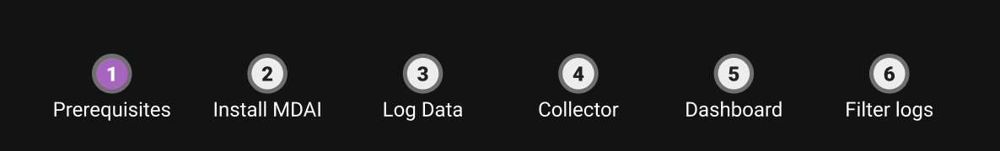

+++
title = 'Quickstart'
weight = 20
+++

{}
_“Enterprise-Class OpenTelemetry Made Simple - Transform OTel from a static configuration challenge into an intelligent, self-managing platform. No more rebuilds for reconfigurations or specialized headcount requirements.”_
{}

Quickly set up the MDAI cluster and test drive MyDecisive observability solutions on your laptop.

This quickstart demonstrates the ease and power of MDAI. You'll install and run the MDAI cluster, emit data using synthetic log generators, and capture and filter that data.

Before you get started, you'll need to log into a GitHub account to access MDAI resources.

> [!NOTE]
> Instructions in our documentation are for \*nix environments.

### Prerequisites

You'll need to install the following software.

- [Docker](https://www.docker.com/products/docker-desktop/).
- [Kubernetes](https://kubernetes.io/releases/download/) (k8s).
- [kubectl and kind](https://kubernetes.io/docs/tasks/tools/).
- [Helm](https://helm.sh/docs/intro/install/).
- (Kubernetes add-on) [cert-manager](https://cert-manager.io/docs/installation/kubectl/)
- (Optional) [k9s](https://k9scli.io/topics/install/).
